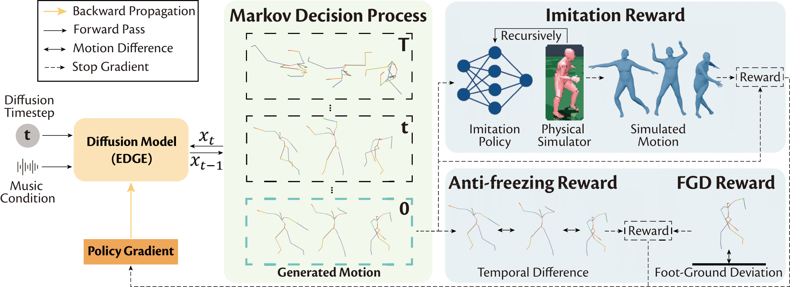
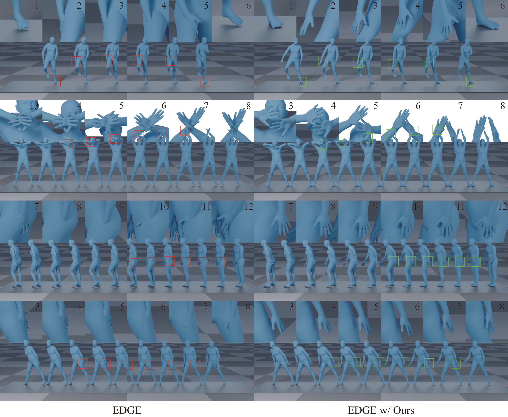

# Skeleton2Stage: Reward-Guided Fine-Tuning for Physically Plausible Dance Generation


<div align="center">
<a href="https://arxiv.org/abs/2602.13778"></a> &nbsp;
<a href="https://jjd1123.github.io/Skeleton2Stage/"></a> &nbsp;

Jidong Jia,
Youjian Zhang,
Huan Fu,
Dacheng Tao

Shanghai Jiao Tong University
</div>

## Abstract
Official implementation of paper: "Skeleton2Stage: Reward-Guided Fine-Tuning for Physically Plausible Dance Generation". Prior dance generation methods often operate on sparse skeletons and overlook geometric constraints of the human body, leading to artifacts such as penetration and foot sliding. We propose a reward-guided fine-tuning framework that aligns generated motions with body geometry, improving physical plausibility.



# Table of Contents
- [Table of Contents](#table-of-contents)
  - [News](#news)
  - [TODOs](#todos)
  - [Introduction](#introduction)
    - [Docs](#docs)
    - [Current Results on EDGE](#current-results-on-edge)
    - [Installation](#installation)
  - [Evaluation](#evaluation)
    - [Evaluation Pipeline](#evaluation-pipeline)
    - [Evaluation on Other Models](#evaluation-on-other-models)
  - [Training](#training)
    - [Data Processing](#data-processing)
    - [Training Imitation Policy](#training-imitation-policy)
    - [RLFT for EDGE](#rlft-for-edge)
    - [RLFT for Other Models](#rlft-for-other-models)
  - [Rendering](#rendering)
  - [Trouble Shooting](#trouble-shooting)
    - [Supporting GPU types newer than A100](#supporting-gpu-types-newer-than-a100)
  - [Citation](#citation)
  - [References](#references)

## News

[Febrary 2, 2026] Training code for imitation policy released.

[January 30, 2026] Training and Evaluation code for EDGE released.

## TODOs

- [ ] Supports for training on GPU newer than A100.

- [x] Installation guidance

- [x] Release training imitation policy code.

- [x] Release training code. 

- [x] Release evaluation code. 

- [ ] Release rendering code.

- [ ] Release guidance for custom models and rewards.

## Introduction
We identify and address a critical yet often-overlooked gap between skeleton-based motion generation and mesh-level body visualization. Specifically, we leverage a physics-based humanoid controller to evaluate the physical plausibility of generated motions and convert its feedback into a reward that penalizes violations of physical laws, especially constraints arising from human body geometry. Combined with complementary reward signals, this reward design enables us to fine-tune a generative model with reinforcement learning to produce motions that remain physically plausible when visualized on a human body mesh.

### Docs 

- [Docs on training imitation policy](code/pretrain/vid2player3d/README.md)

- [Docs on RLFT pipeline](code/rl_finetune/README.md)

- [Docs on MDM+physics-based motion projection](code/pretrain/vid2player3d/embodied_pose/MDM/README.md)

### Current Results on EDGE

All evaluation is done using the mean SMPL body shape.



### Installation

To create the environment, follow the following instructions: 

1. Clone the project:
    ```bash
    git clone https://github.com/jjd1123/Skeleton2Stage.git
    ```

2. Create new conda environment and install pytroch:
    ```bash
    conda create -n isaac python=3.8
    pip install -r requirement.txt
    ```

3. Download and setup [Isaac Gym](https://developer.nvidia.com/isaac-gym). 
  
4. Download the MuJoCo version 2.1 for [Linux](https://mujoco.org/download/mujoco210-linux-x86_64.tar.gz).

5. Install [torch-mesh-isect](https://github.com/vchoutas/torch-mesh-isect) for body penetration rate evaluation.

6. Configure your paths in [`environment.sh`](environment/environment.sh).  
   For a cleaner project layout, you can place Isaac Gym, MuJoCo, and torch-mesh-isect under the [`environment/`](environment/) directory.

7. This repository additionally depends on the following libraries, which may require special installation procedures:
* [jukemirlib](https://github.com/rodrigo-castellon/jukemirlib)
* [pytorch3d](https://github.com/facebookresearch/pytorch3d)
* [accelerate](https://huggingface.co/docs/accelerate/v0.16.0/en/index)
  * Note: after installation, don't forget to run `accelerate config` . We use fp16.

8. Place the smpl files under [`body_models/`](body_models) like following,

    ```bash
    body_models/
    ├── README.md            # This guide file
    │
    ├── smpl/
    │   ├── J_regressor_extra.npy
    │   ├── kintree_table.pkl
    │   ├── smplfaces.npy
    │   ├── SMPL_FEMALE.pkl
    │   ├── SMPL_MALE.pkl
    │   └── SMPL_NEUTRAL.pkl
    │
    ├── smplh/
    │   ├── female/
    │   │   └── model.npz
    │   ├── male/
    │   │   └── model.npz
    │   └── neutral/
    │       └── model.npz
    │
    └── smplx/
        ├── female/
        │   └── model.npz
        ├── male/
        │   └── model.npz
        └── neutral/
            └── model.npz
    ```


## Evaluation

### Evaluation Pipeline
Before evaluation, make sure you have:

(1) the correct settings in metric computation scripts, and 

(2) the correct model in Line 56 in [`EDGE.py`](code/rl_finetune/EDGE.py).

```bash
cd code/rl_finetune
bash eval.sh exp_name epoch_num motion_save_root ckpt_root cached_music_features
```
### Evaluation on Other Models
```bash
Coming soon!
```

## Training

### Data Processing
To fine-tune the generative model, you need the following:

1. A base checkpoint of the generative model;
2. Conditioning data for training-time sampling;
3. A checkpoint of the trained imitation policy.

In this section, we provide [data](https://drive.google.com/file/d/1y-4fZnxekzd5UVEpnPj95ksORIcDq38z/view?usp=sharing) (preprocessed data and the pretrained imitation policy) for a minimal example: finetuning EDGE on AIST++. You can directly run following scripts:
```bash
cd code/rl_finetune
# download EDGE checkpoint.
bash download_mode.sh
# download preprocessed data of AIST++ and the pretrained imitation policy.
bash download_data.sh
``` 
- Note: We use DVC for dataset version control. Please follow the README in the downloaded data directory for a quick setup.

We will also explain how to prepare your own datasets and pre-trained models below.

#### 1) Pretrain a base generative model
You can follow the instructions from:
- [EDGE](https://github.com/Stanford-TML/EDGE)
- [POPDG](https://github.com/Luke-Luo1/POPDG)

#### 2) Pretrain an imitation policy
Follow the instructions in [Training Imitation Policy](#training-imitation-policy).

#### 3) Prepare the conditioning data
```bash
Coming soon!
```
 
### Training Imitation Policy
1. Prepare the Expert Dataset

    First, prepare the expert dataset for imitation policy training by following the guide in the [Vid2player3d README](code/pretrain/vid2player3d/README.md). 

2. Run the Training Script
    
    Once the dataset is ready, start the training by executing the `train.sh` script.
    ```bash
    cd code/pretrain/vid2player3d
    bash train.sh PATH_TO_VID2PLAYER3D
    ```

    - Customization: You can modify the training strategy by changing the configuration file and the execution order within `train.sh`.
### RLFT for EDGE
(1) Change the weight of different rewards in [`reward.yaml`](code/rl_finetune/reward.yaml).

(2) Set the correct model for finetuning in Line 56 in [`EDGE.py`](code/rl_finetune/EDGE.py).
```bash
cd code/rl_finetune
bash run.sh exp_name gpu_parallel_num epoch_num batch_size
```
### RLFT for Other Models
```bash
Coming soon!
```

## Rendering
```bash
Coming soon!
```

## Trouble Shooting

### Supporting GPU types newer than A100
Coming soon!

## Citation
If you find this work useful for your research, please cite our paper:
```
@misc{jia2026skeleton2stagerewardguidedfinetuningphysically,
      title={Skeleton2Stage: Reward-Guided Fine-Tuning for Physically Plausible Dance Generation}, 
      author={Jidong Jia and Youjian Zhang and Huan Fu and Dacheng Tao},
      year={2026},
      eprint={2602.13778},
      archivePrefix={arXiv},
      primaryClass={cs.CV},
      url={https://arxiv.org/abs/2602.13778}, 
}   
```


## References
This repository is built on top of the following amazing repositories:
* Main code framework is from: [EDGE](https://github.com/Stanford-TML/EDGE)
* Imitation policy is from: [vid2player3d](https://github.com/nv-tlabs/vid2player3d)
* SMPL models and layer is from: [SMPL-X model](https://github.com/vchoutas/smplx)
* README template is from: [PHC](https://github.com/ZhengyiLuo/PHC)

Please follow the lisence of the above repositories for usage. 