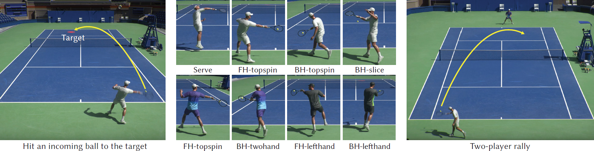

# This is a modified version of vid2player3d
## Enabled Features
- [Data Preparation](#data-preparation): Provides tools to prepare training data from the AMASS, AIST++, and PopDanceSet datasets.
- Collision Checks: Enables collision checks on SMPL-based characters.
- [Training](#low-level-policy) an imitation policy on self-defined expert datasets to control a SMPL-based character.
- [MDM+physics-based motion projection](#mdmphysics-based-motion-projection-demo).
# Learning Physically Simulated Tennis Skills from Broadcast Videos

<strong>Haotian zhang</strong>, Ye Yuan, Viktor Makoviychuk, Yunrong Guo, Sanja Fidler, Xue Bin Peng, Kayvon Fatahalian

SIGGRAPH 2023 (best paper honorable mention) 

[Paper](https://research.nvidia.com/labs/toronto-ai/vid2player3d/data/tennis_skills_main.pdf) |
[Project](https://research.nvidia.com/labs/toronto-ai/vid2player3d/) |
[Video](https://youtu.be/ZZVKrNs7_mk) 



### Note: the current release provides the implementation of the hierarchical controller, including the low-level imitation policy, motion embedding and the high-level planning policy, as well as the environment setup in IsaacGym. Unfortunately, the demo can NOT run because the trained models are currently not available due to license issues. 

# News
[2023/11/28] Training code for the low-level policy is released.

[2023/11/01] Demo code for the hierarchical controller is released.

# Environment setup (You can directly skip the first two steps if you have setup the enironment following the guidance in the main [README](../../../README.md).)

### 1. Download IsaacGym and create python virtual env
You can download IsaacGym Preview Release 4 from the official [site](https://developer.nvidia.com/isaac-gym).
Then download Miniconda3 from [here](https://repo.anaconda.com/miniconda/Miniconda3-py37_23.1.0-1-Linux-x86_64.sh).
Create a conda virtual env named `rlgpu` by running `create_conda_env_rlgpu.sh` from IsaacGym, either python3.7 or python3.8 works.
Note you might need to run the following command or add it to your `.bashrc` if you encounter the error `ImportError: libpython3.7m.so.1.0: cannot open shared object file: No such file or directory` when running IsaacGym.
```
export LD_LIBRARY_PATH=<YOUR CONDA PATH>envs/rlgpu/lib/
``` 

### 2. Install dependencies 
Enter the created virtual env and run the install script.
```
conda activate rlgpu
bash install.sh
```
To install additional dependencies for the low-level policy, follow the instructions in [install_embodied_pose.sh](install_embodied_pose.sh). 

### 3. Install [smpl_visualizer](https://github.com/Haotianz94/smpl_visualizer) for visualizing results
Git clone and then run 
```
bash install.sh
```

### 4. Download data/checkpoints

Download [data](https://drive.google.com/drive/folders/1kkM9tl1T3dXZbvh5oYHSerL0JkgaL1Mi?usp=sharing) into `vid2player3d/data`.

Download checkpoints of motion embedding and trained polices into `vid2player3d/results` (currently unavailable).

Download SMPL by first registering [here](https://smpl.is.tue.mpg.de/login.php) and then download the [models](https://download.is.tue.mpg.de/download.php?domain=smpl&sfile=SMPL_python_v.1.0.0.zip) (male and female models) into `smpl_visualizer/data/smpl` and rename the files as `SMPL_MALE.pkl` and `SMPL_FEMALE.pkl`.

For training the low-level policy, also copy the smpl model files into `vid2player3d/data/smpl`.

# Training

### Low-level policy
We provide the code for training the low-level policy in [embodied_pose](embodied_pose). Here we provide an example, the low-level policy is trained in two stages using AMASS motions and AIST++ motions. You can run the following script to execute the two-stage training (assuming the motion data are available).
```
bash train.sh
```
<a id="data-preparation"></a>
[convert_amass_isaac.py](uhc/utils/convert_amass_isaac.py) shows how to convert the AMASS motion dataset into the format that can be used for our training code. **We further show how to convert AIST++ and PopDanceSet into the format that can be used for our training code under the same [folder](uhc/utils/).**

# MDM+physics-based motion projection demo

Following the guidance in [MDM](embodied_pose/MDM/README.md) for setup, and then run:
```
bash run.sh
```

# Citation
```
@article{
  zhang2023vid2player3d,
  author = {Zhang, Haotian and Yuan, Ye and Makoviychuk, Viktor and Guo, Yunrong and Fidler, Sanja and Peng, Xue Bin and Fatahalian, Kayvon},
  title = {Learning Physically Simulated Tennis Skills from Broadcast Videos},
  journal = {ACM Trans. Graph.},
  issue_date = {August 2023},
  numpages = {14},
  doi = {10.1145/3592408},
  publisher = {ACM},
  address = {New York, NY, USA},
  keywords = {physics-based character animation, imitation learning, reinforcement learning},
}
```

# References
This repository is built on top of the following repositories:
* Low-level imitation policy is adapted from [EmbodiedPose](https://github.com/ZhengyiLuo/EmbodiedPose)
* Motion embedding is adapted from [character-motion-vaes](https://github.com/electronicarts/character-motion-vaes)
* RL environment in IsaacGym is adapted from [ASE](https://github.com/nv-tlabs/ASE/)
  
Here are additional references for reproducing the video annotation pipeline:
* Player detection and tracking: [Yolo4](https://github.com/Tianxiaomo/pytorch-YOLOv4)
* 2D Pose keypoint detection: [ViTPose](https://github.com/ViTAE-Transformer/ViTPose)
* 3D Pose estimation and mesh recovery: [HybrIK](https://github.com/Jeff-sjtu/HybrIK)
* 2D foot contact [detection](https://github.com/yul85/movingcam)
* Global root trajectory optimization: [GLAMR](https://github.com/NVlabs/GLAMR)
* Tennis court line [detection](https://github.com/gchlebus/tennis-court-detection)


# Contact
For any question regarding this project, please contact Haotian Zhang via haotianz@nvidia.com.
